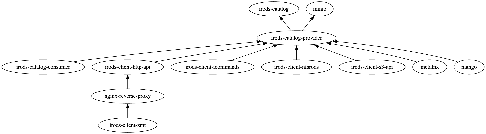

# irods_demo

This repository provides a docker-compose project designed to easily stand up a **DEMONSTRATION** of the iRODS server and a few of its clients.  It is intended for education and exploration.

**DO NOT USE IN PRODUCTION.**



## Requirements

- docker
- docker compose

A minimal configuration will have:

- 2 CPUs
- 4 GB RAM
- 10 GB storage

## Run

If you have not initialized submodules in this repo, run the following before attempting to start the Compose project:

```bash
git submodule update --init
```

`git submodule update` should be run any time the submodule is updated, so make sure to run it any time you pull or checkout different commits.

To run all services:

```bash
docker compose up
```

To run an individual service (and all services on which it depends):

```bash
docker compose up <service-name>
```

For example, this command will spawn containers for the following services:

1. `irods-catalog`
2. `irods-catalog-provider`
3. `irods-client-http-api`
4. `nginx-reverse-proxy`
5. `irods-client-zmt`

```bash
docker compose up irods-client-zmt
```

For more information about Compose CLI options, see Docker Compose documentation: https://docs.docker.com/engine/reference/commandline/compose

## Notes for services

### `irods-client-zmt` / Zone Management Tool / ZMT

The ZMT service assumes that containers are running on the same host as the browser. If this is not the case (launching irods_demo via ssh, etc.), the value of `REACT_APP_HTTP_API_URL` should be changed to an address which correctly maps to the `nginx-reverse-proxy` service and that is reachable by both the ZMT service and the host running the browser.

```diff
-            - REACT_APP_HTTP_API_URL=http://localhost/irods-http-api/x.x.x
+            - REACT_APP_HTTP_API_URL=http://<public-hostname-or-ip>/irods-http-api/x.x.x
```

### `irods-client-nfsrods` / NFSRODS

Once the service is running, the NFS server needs to be accessed from a mountpoint. This can be done with the following command:

```bash
sudo mount -o sec=sys,port=2050 localhost:/ ./irods_client_nfsrods/nfs_mount
```

The hostname can also be the IP address of the container providing the service in the `irods-demo_default` Docker network if running from the same host. The mountpoint can exist on any other machine which can reach the host running the container providing the service because the port is being exposed, in which case the FQDN or IP address for the host machine can be used. For more information about mounting NFSRODS, see the README for the project: https://github.com/irods/irods_client_nfsrods#mounting

When you are ready to stop the service, it would be a good idea to unmount first. This can be done by running the following:

```bash
sudo umount ./irods_client_nfsrods/nfs_mount
```

The NFSRODS service maps the `/etc/passwd` file on the host machine to the `/etc/passwd` file in the container providing the service. The user(s) accessing the mountpoint will need to exist as iRODS users as well in order to be able to interact with the mountpoint. This can be done by running the following command on the host machine for each `username` which needs to be mapped:

```bash
docker exec irods-demo-irods-client-icommands-1 iadmin mkuser <username> rodsuser
```

### `irods-client-http-api` / iRODS HTTP API

The HTTP API service assumes that containers are running on the same host as the browser. If this is not the case (launching irods_demo via ssh, etc.), the value of `IRODS_HOST` should be changed to an address which correctly maps to the `irods-catalog` service and that is reachable by both the HTTP API service and the host running the browser.

## Troubleshooting

First of all, make sure that you have initialized submodules in this repo by running:

```bash
git submodule update --init
```

`git submodule update` should be run any time the submodule is updated, so make sure to run it any time you pull or checkout different commits.

### Checking logs and status of services

If you encounter issues with the iRODS services, you can check the logs of a specific service by running:

```bash
docker compose logs <service-name>
```

For example, to check the logs of the iRODS catalog service:

```bash
docker compose logs irods-catalog
```

You can also check the logs of all services by running:

```bash
docker compose logs
```

You can also check the status of all services by running:

```bash
docker compose ps
```

If you need to stop all services, you can run:

```bash
docker compose down
```

If you need to stop an individual service, you can run:

```bash
docker compose stop <service-name>
```

For example, to stop the iRODS catalog service:

```bash
docker compose stop irods-catalog
```

If you need to restart all services, you can run:

```bash
docker compose restart
```

If you need to restart an individual service, you can run:

```bash
docker compose restart <service-name>
```

For example, to restart the iRODS catalog service:

```bash
docker compose restart irods-catalog
```

If you need to remove all services, you can run:

```bash
docker compose down --volumes
```

This will remove all services and their associated volumes. Be careful when using this command as it will delete all data stored in the volumes.

If you need to remove an individual service, you can run:

```bash
docker compose rm <service-name>
```

For example, to remove the iRODS catalog service:

```bash
docker compose rm irods-catalog
```

This will remove the service but not its associated volumes. To remove the volumes as well, you can run:

```bash
docker compose rm --volumes <service-name>
```

For example, to remove the iRODS catalog service and its associated volumes:

```bash
docker compose rm --volumes irods-catalog
```

To really clean up everything, you can run:

```bash
docker compose down --volumes --rmi all --remove-orphans
```

This will remove all services, their associated volumes, all images, and any orphaned containers.

