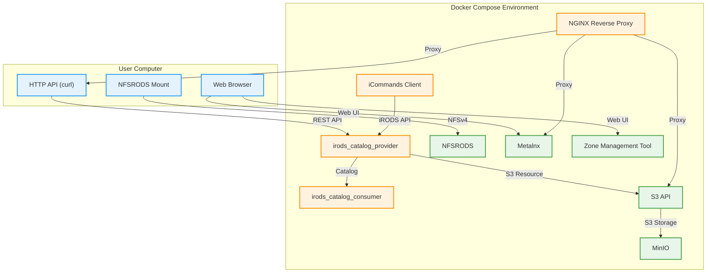

# Walkthrough: Getting Started with iRODS Demo

---

## Environment Overview

Below is a diagram showing how your computer interacts with the iRODS demo environment deployed via Docker Compose. Each service is represented as a container, and their relationships are shown for clarity.



This diagram shows:

- How you interact with the environment using NFS mounts, HTTP API, and your browser.
- The main iRODS services and supporting components (Metalnx, ZMT, S3 API, MinIO, NGINX).
- The connections between services and your computer.

---

Welcome! This guide will walk you through deploying the iRODS demo stack, setting up users, mounting NFSRODS, uploading files with metadata, using Metalnx, and exploring advanced features like the HTTP and S3 APIs. If you’re new to iRODS, you’re in the right place!

## 1. Deploy the Demo Stack

Make sure you have Docker and Docker Compose installed. In your project directory, run:

```bash
docker compose up -d
```

This will start all required services: iRODS catalog, provider, clients, Metalnx, NFSRODS, MinIO, and NGINX reverse proxy.

---

## 2. Set Up Users

### Create a Local User

1. Enter the iRODS provider container (the name is usually `irods-demo-irods-catalog-provider-1`). If you're unsure, you can look it up with:

   ```bash
   docker ps --filter "name=irods-catalog-provider" --format "{{.Names}}"
   ```

   Then connect as the 'irods' user:

   ```bash
   docker exec -it irods-demo-irods-catalog-provider-1 su - irods
   ```

1. Create a user named after an original iRODS developer (e.g., Reagan):

   ```bash
   iadmin mkuser Reagan rodsuser
   iadmin moduser Reagan password reagan_password
   ```

### Create a rodsadmin User

`rodsadmin` users have administrative privileges in iRODS.

1. In the same container, as the 'irods' user:

   ```bash
   iadmin mkuser Rajasekar rodsadmin
   iadmin moduser Rajasekar password rajasekar_password
   ```

---

## 3. Mount NFSRODS Locally

**Linux hosts only!** (Pull requests for other OS’s are welcome.)

1. Create the mount directory (if it doesn't exist):

   ```bash
   sudo mkdir -p /mnt/nfsrods
   ```

2. Ensure the NFS client is installed (Linux):

   ```bash
   sudo apt-get update
   sudo apt-get install nfs-common
   ```

3. Mount it (default export is `/`, so use this command):

   ```bash
   sudo mkdir -p /mnt/nfsrods
   sudo mount -o sec=sys,port=2050 localhost:/ /mnt/nfsrods
   ```

   If you change the export path or port in `docker-compose.yml` or the exports file, update the mount command accordingly.

4. Your iRODS zone will appear as a subdirectory under the mount point, typically `/mnt/nfsrods/tempZone`. All your iRODS files and directories will be accessible there.

---

## 4. Upload a File with Metadata (Command Line)

1. Enter the iRODS iCommands client container (usually `irods-demo-irods-client-icommands-1`). If you're unsure, look it up with:

   ```bash
   docker ps --filter "name=irods-client-icommands" --format "{{.Names}}"
   ```

   Then run iRODS commands directly (no need to switch user):

   ```bash
   docker exec -it irods-demo-irods-client-icommands-1 bash
   ```

1. Generate a simple file to upload (e.g., localfile.txt):

   ```bash
   echo "This is a test file for iRODS." > /tmp/localfile.txt
   ```

1. Upload the file and add real metadata (as the rods user):

   ```bash
   iput /tmp/localfile.txt /tempZone/home/rods/
   imeta add -d /tempZone/home/rods/localfile.txt project DemoProject
   imeta add -d /tempZone/home/rods/localfile.txt owner rods
   imeta add -d /tempZone/home/rods/localfile.txt description "Test file for walkthrough"
   ichmod read public /tempZone/home/rods/localfile.txt
   ichmod read public /tempZone/home/rods
   ```

---

## 5. Connect to Metalnx and View Metadata

1. Open Metalnx in your browser: [http://localhost:8080/metalnx/login/](http://localhost:8080/metalnx/login/)
1. Log in with your iRODS credentials (e.g., Reagan or Rajasekar).
1. Browse to your uploaded file and view its metadata.

---

## 6. View the File in the NFSRODS Mount

On your Linux host:

```bash
ls /mnt/nfsrods/tempZone/home/rods/
cat /mnt/nfsrods/tempZone/home/rods/localfile.txt
```

You should see the file you uploaded.

---

## 7. Upload via HTTP API and Download via iCommands

1. Add metadata to the uploaded file and make it readable by all users:

   ```bash
   imeta add -d /tempZone/home/rods/anotherfile.txt project DemoProject
   imeta add -d /tempZone/home/rods/anotherfile.txt owner rods
   imeta add -d /tempZone/home/rods/anotherfile.txt description "Second test file for walkthrough"
   ichmod read public /tempZone/home/rods/anotherfile.txt
   ```

1. Still in the iRODS iCommands client container, download the first file:

   ```bash
   iget /tempZone/home/rods/localfile.txt /tmp/localfile.txt
   ```

1. Check both files:

   ```bash
   ils /tempZone/home/rods/
   ```

---

## 8. Administrator: Connect to the Zone Management Tool (ZMT)

1. Open ZMT in your browser: [http://localhost:9000](http://localhost:9000)
1. Log in as `Rajasekar`.
1. Here you can:
   - Manage users and groups
   - View resource status
   - Monitor system health
   - Configure policies

---

## 9. S3 API & Storage Resources

- The S3 API is available via the `irods_client_s3_api` service. See `config.json` for details.
- The demo uses both local filesystems and S3 resources (via MinIO) as iRODS storage resources.
- MinIO acts as a local S3 proxy, simulating Amazon S3. You can test S3 operations without an AWS account.
- The `docker-compose.yml` shows how these resources are configured and exposed to iRODS.

---

## Questions or Improvements?

If you’re on macOS or Windows and want to help with NFSRODS instructions, or have other improvements, please submit a pull request!

Happy experimenting!
